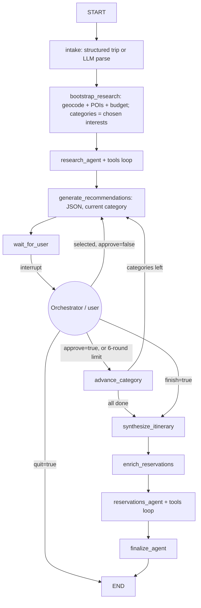

# Travel Agent — Activities Specialist (LangGraph)

The **activities agent** of a multi-agent travel-planning system. An orchestrator talks to the user and delegates to three agents: a flight agent, a hotel agent, and this one — responsible for **activities planning only**.

Given a trip request, this agent researches activities within a **4-hour drive** of the destination, then walks through them **one category at a time** (food, culture, nature, ...): it presents options, refines with similar suggestions after each user pick (up to 5 refinement rounds per category), and advances when the user approves. After the last category it produces a full day-by-day **itinerary** with a **reservation checklist** and booking links.

**Scope rules:**
- **Accommodation and flights are out of scope** — the hotel and flight agents own those. This agent never recommends, books, or budgets for lodging.
- `budget_usd` is the **activities-scope budget** (food, activities, transport, buffer). The orchestrator must subtract the flight/accommodation share before calling this agent.
- All agent recommendation replies are **structured JSON** (see formats below).

## Quick start

```bash
cd Projects/travel-agent
python -m venv .venv
.venv\Scripts\activate          # Windows
pip install -e .

copy .env.example .env          # add API keys, see below
travel-agent "Barcelona, 2026-09-10 to 2026-09-16, budget $4500, love food and Gaudi, relaxed pace"
```

Environment variables (see `.env.example`):

| Key | Purpose |
|-----|---------|
| `NEBIUS_API_KEY` | Required — API key for the OpenAI-compatible LLM endpoint |
| `NEBIUS_BASE_URL` | Required — base URL of the LLM endpoint |
| `TRAVEL_AGENT_MODEL` | Model name (default: `gpt-4o-mini`) |
| `TAVILY_API_KEY` | Optional — live web search for booking requirements |
| `GEOAPIFY_API_KEY` | Optional — Geoapify Places POI discovery within drive radius (free tier at geoapify.com) |

## Using it from the orchestrator: `ActivitiesAgent`

`src/travel_agent/agent.py` exposes the agent as a plain object — **JSON in, JSON out**, no HTTP layer. The orchestrator creates one instance and keeps it alive for the lifetime of its sessions (state is in-process memory):

```python
from travel_agent.agent import ActivitiesAgent

agent = ActivitiesAgent()

out = agent.handle({"action": "start", "trip": {...}})       # dict -> dict
out = agent.handle({"action": "feedback",
                    "session_id": out["session_id"],
                    "feedback": "approve"})

raw = agent.handle_json('{"action": "status", "session_id": "..."}')  # str -> str
```

Every `interrupt()` pause in the graph becomes an `awaiting_feedback` response; the orchestrator shows the recommendations to the user, collects the reply, and relays it with the `feedback` action. Errors never raise — they come back as JSON.

### Request formats

**`start` — begin a session.** Provide `trip` (structured, preferred — no LLM parsing) or `request` (free text, parsed by the LLM):

```json
{
  "action": "start",
  "trip": {
    "destination": "Kyoto",
    "start_date": "2026-04-03",
    "end_date": "2026-04-09",
    "budget_usd": 2800,
    "travelers": 2,
    "interests": ["culture", "food"],
    "travel_style": "balanced",
    "dietary_restrictions": [],
    "mobility_notes": "",
    "notes": "temples and kaiseki"
  }
}
```

Required trip fields: `destination`, `start_date`, `end_date`, `budget_usd`. Defaults: `travelers` 2, `interests` `["culture", "food"]`, `travel_style` `"balanced"`. Enums: `travel_style` ∈ relaxed, balanced, packed.

**`interests` is a closed granular checklist, grouped into 8 categories.** The orchestrator presents the items below as checkboxes; checking a **group name** selects that whole group. The recommendation loop runs **one round per category group that has checked items**, in checklist order — so granular picks like `buddhist_temples` and `museums` share a single culture round. Values outside the list fail validation.

| Group (= round) | Checklist items                                                                                                                                                                                                                                                                                                                                                                                                                     |
|---|-------------------------------------------------------------------------------------------------------------------------------------------------------------------------------------------------------------------------------------------------------------------------------------------------------------------------------------------------------------------------------------------------------------------------------------|
| `culture` | `museums`, `theatres_and_entertainments`, `urban_environment`, `historical_places`, `fortifications`, `monuments_and_memorials`, `archaeology`, `burial_places`, `historic_architecture`, `skyscrapers`, `bridges`, `towers`, `lighthouses`, `religion`, `churches`, `cathedrals`, `mosques`, `synagogues`, `buddhist_temples`, `hindu_temples`, `egyptian_temples`, `other_temples`, `monasteries`, `free_tours`†, `guided_tours`† |
| `nature` | `nature_reserves`, `gardens_and_parks`, `view_points`, `islands`, `natural_springs`, `geological_formations`, `water`, `glaciers`                                                                                                                                                                                                                                                                                                   |
| `beach` | `beaches`                                                                                                                                                                                                                                                                                                                                                                                                                           |
| `food` | `restaurants`, `cafes`, `bakeries`, `fast_food`, `food_courts`, `picnic_site`                                                                                                                                                                                                                                                                                                                                                       |
| `nightlife` | `pubs`, `bars`, `biergartens`, `nightclubs`, `casino`, `alcohol`, `hookah`                                                                                                                                                                                                                                                                                                                                                          |
| `adventure` | `climbing`, `diving`, `surfing`, `kitesurfing`, `winter_sports`, `stadiums`, `pools`                                                                                                                                                                                                                                                                                                                                                |
| `family` | `amusement_parks`, `water_parks`, `zoos`, `aquariums`, `children_theatres`, `circuses`, `planetariums`, `miniature_parks`, `roller_coasters`, `ferris_wheels`, `baths_and_saunas`                                                                                                                                                                                                                                                   |
| `shopping` | `malls`, `marketplaces`, `outdoor`, `supermarkets`, `conveniences`, `fish_stores`                                                                                                                                                                                                                                                                                                                                                   |

† Web-search-backed: these have no POI category — the research agent finds them via web search and the recommendation rounds cover them from those findings. All other items are stable checklist ids, mapped internally to Geoapify Places categories for the POI query.

Free-text alternative:

```json
{ "action": "start", "request": "Kyoto, April 3-9 2026, $2800, temples and kaiseki" }
```

**`feedback` — relay the user's selections (structured JSON, not free text):**

```json
{
  "action": "feedback",
  "session_id": "<from start>",
  "feedback": {
    "selected": ["Nishiki Market food walk", "Kikunoi Honten"],
    "approve": false
  }
}
```

Feedback object fields (all optional; empty object = "show me different options"):

| Field | Type | Meaning |
|---|---|---|
| `selected` | list of strings | Names of recommended activities the user keeps — recorded as preferences (tagged with the category) and used to build the itinerary |
| `approve` | bool | Current category is done — advance to the next. Any `selected` in the same payload is still recorded |
| `finish` | bool | Skip remaining categories and build the itinerary now |
| `quit` | bool | End the session without an itinerary |

Semantics per round: `selected` + `approve: false` → the agent recommends more similar activities in the same category; `approve: true` → next category (after the last one the itinerary builds automatically). Free-text feedback is rejected with an error — plain strings are only understood by the standalone CLI debug mode.

**`status` — inspect a session (debugging):**

```json
{ "action": "status", "session_id": "..." }
```

### Response formats

**`awaiting_feedback`** — recommendations for the current category; orchestrator must send `feedback` next:

```json
{
  "session_id": "abc-123",
  "status": "awaiting_feedback",
  "recommendations": {
    "category": "food",
    "round": 1,
    "message": "Kyoto is a food lover's dream — here are my top picks.",
    "recommendations": [
      {
        "name": "Nishiki Market food walk",
        "description": "Sample yuba, tamagoyaki and pickles along 400m of stalls.",
        "estimated_cost_usd": 40,
        "duration_hours": 2.5,
        "drive_minutes_from_base": 10,
        "reservation_required": false
      }
    ],
    "question": "Which of these would you like to keep? I can also suggest more like them, or we can move on.",
    "categories_remaining": ["culture", "nature"]
  },
  "prompt": "Reply with a JSON feedback object: 'selected' = names of the 'food' activities to keep, 'approve' = category done, 'finish' = build the itinerary now, 'quit' = end without one."
}
```

`category`, `round` (1 = initial, 2–6 = refinements), and `categories_remaining` are set from graph state, so progress info is always accurate.

**`completed`** — all categories approved (or the user asked to finalize); the full plan:

```json
{
  "session_id": "abc-123",
  "status": "completed",
  "itinerary": {
    "destination": "Kyoto",
    "trip_days": 7,
    "summary": "...",
    "days": [
      {
        "day_number": 1,
        "date": "2026-04-03",
        "theme": "Arrival & Gion",
        "morning": ["..."], "afternoon": ["..."], "evening": ["..."],
        "meals": ["..."],
        "estimated_daily_cost_usd": 180,
        "driving_notes": "..."
      }
    ],
    "day_trips": ["Nara (50 min drive)"],
    "budget": {
      "food_estimate_usd": 1064,
      "activities_estimate_usd": 1092,
      "transport_estimate_usd": 392,
      "buffer_usd": 252,
      "total_usd": 2800,
      "within_budget": true,
      "notes": null
    },
    "tips": ["..."]
  },
  "reservation_checklist": [
    {
      "name": "Kikunoi Honten",
      "category": "restaurant",
      "reservation_required": true,
      "lead_time_days": 30,
      "booking_url": "https://...",
      "booking_platform": "...",
      "notes": null,
      "scheduled_day": 2
    }
  ],
  "user_preferences": ["[food] Nishiki Market food walk", "[food] Kikunoi Honten"]
}
```

Note: `budget` has **no lodging field** by design.

**`ended`** — user quit without an itinerary:

```json
{ "session_id": "abc-123", "status": "ended", "user_preferences": ["..."] }
```

**`status` response** (for the `status` action):

```json
{
  "session_id": "abc-123",
  "status": "awaiting_feedback",
  "phase": "recommendation",
  "categories": ["food", "culture", "nature"],
  "current_category": "culture",
  "round": 2,
  "user_preferences": ["[food] ..."]
}
```

**`error`** — any failure (bad input, unknown session, tool/LLM failure):

```json
{ "status": "error", "error": "Unknown session: nope", "session_id": "nope" }
```

Session lifecycle: `awaiting_feedback` → (`completed` | `ended`). Finished sessions reject further feedback with an error. Sessions live in process memory (`MemorySaver`) and are lost on restart — swap in a persistent checkpointer for production.

## Orchestrator integration guide

Step by step, what the orchestrator implements:

1. **Create one `ActivitiesAgent` per process and keep it alive.** Sessions live inside the instance — a new instance forgets every session. One instance serves many concurrent sessions (each `session_id` is isolated).
2. **Collect the trip from the user**: destination, dates, activities-scope budget (total minus flights/accommodation — those belong to the flight/hotel agents), and interests from the closed checklist above rendered as checkboxes.
3. **Send `start`** and hold on to the returned `session_id`.
4. **Render each `awaiting_feedback` response**: show `recommendations.message`, the `recommendations.recommendations` array as selectable cards/checkboxes, and `recommendations.question`. `category`, `round`, and `categories_remaining` are reliable for progress UI (they come from graph state, not the LLM).
5. **Send the user's selections back** as the structured feedback object — the `name` values of the selected activities, plus `approve` when the user is done with the category. Never send free text; it's rejected.
6. **Repeat** until `status` is `completed` (present `itinerary` + `reservation_checklist`) or `ended` (user quit). A finished session accepts no more feedback — start a new one for a new trip.
7. **Treat `status: "error"` as a normal response**, not an exception — show/log `error` and decide whether to retry or restart the session.

Minimal integration loop:

```python
from travel_agent.agent import ActivitiesAgent

agent = ActivitiesAgent()          # once, at startup

def plan_activities(trip: dict, ask_user) -> dict:
    """ask_user(recommendations: dict) -> feedback dict from your UI."""
    response = agent.handle({"action": "start", "trip": trip})
    while response.get("status") == "awaiting_feedback":
        feedback = ask_user(response["recommendations"])   # {"selected": [...], "approve": ...}
        response = agent.handle({
            "action": "feedback",
            "session_id": response["session_id"],
            "feedback": feedback,
        })
    return response                  # completed / ended / error
```

### Mock orchestrator (test the contract without the real one)

Save as `examples/mock_orchestrator.py` and run it to drive a full session — scripted or interactive — printing every request/response pair:

```python
"""Mock orchestrator: drives ActivitiesAgent exactly like the real orchestrator would."""

from __future__ import annotations

import argparse
import json
from pathlib import Path

from dotenv import load_dotenv

from travel_agent.agent import ActivitiesAgent

SAMPLE_START_REQUEST = {
    "action": "start",
    "trip": {
        "destination": "Kyoto",
        "start_date": "2026-04-03",
        "end_date": "2026-04-09",
        "budget_usd": 2800,
        "travelers": 2,
        "interests": [
            "buddhist_temples", "monasteries", "free_tours",
            "view_points", "gardens_and_parks", "restaurants", "cafes",
        ],
        "travel_style": "balanced",
        "dietary_restrictions": ["vegetarian"],
        "notes": "temples and kaiseki",
    },
}

MAX_TURNS = 25  # safety net against infinite loops


def scripted_feedback(response: dict) -> dict:
    """Simulate the user: keep the top 2 activities on the first round of each
    category and ask for more; on later rounds keep 1 more and approve."""
    recommendations = response.get("recommendations", {})
    names = [r.get("name") for r in recommendations.get("recommendations", []) if r.get("name")]
    if recommendations.get("round", 1) == 1:
        return {"selected": names[:2], "approve": False}
    return {"selected": names[:1], "approve": True}


def interactive_feedback() -> dict:
    raw = input(
        "\nActivity names to keep (comma-separated), or 'approve' / 'finish' / 'exit': "
    ).strip()
    lowered = raw.lower()
    if lowered == "approve":
        return {"approve": True}
    if lowered == "finish":
        return {"finish": True}
    if lowered in {"exit", "quit"}:
        return {"quit": True}
    return {"selected": [s.strip() for s in raw.split(",") if s.strip()]}


def show(label: str, payload: dict) -> None:
    print(f"\n{'=' * 70}\n{label}\n{'=' * 70}")
    print(json.dumps(payload, indent=2, ensure_ascii=False, default=str))


def main() -> None:
    parser = argparse.ArgumentParser(description="Drive ActivitiesAgent like the orchestrator")
    parser.add_argument("--interactive", action="store_true", help="type feedback yourself")
    parser.add_argument("--out", type=Path, help="write the full transcript JSON to this path")
    args = parser.parse_args()

    load_dotenv()
    agent = ActivitiesAgent()
    transcript: list[dict] = []

    def call(request: dict) -> dict:
        show(">>> ORCHESTRATOR -> AGENT", request)
        response = agent.handle(request)
        show("<<< AGENT -> ORCHESTRATOR", response)
        transcript.append({"request": request, "response": response})
        return response

    response = call(SAMPLE_START_REQUEST)
    session_id = response.get("session_id")

    turn = 0
    while response.get("status") == "awaiting_feedback" and turn < MAX_TURNS:
        turn += 1
        if args.interactive:
            feedback = interactive_feedback()
        else:
            feedback = scripted_feedback(response)
            print(f"\n[scripted user selection] {json.dumps(feedback, ensure_ascii=False)}")
        response = call({"action": "feedback", "session_id": session_id, "feedback": feedback})

    call({"action": "status", "session_id": session_id})

    print(f"\nSession finished with status: {response.get('status')}")
    if response.get("status") == "completed":
        days = response.get("itinerary", {}).get("days", [])
        checklist = response.get("reservation_checklist", [])
        print(f"Itinerary: {len(days)} days, {len(checklist)} reservation items.")

    if args.out:
        args.out.write_text(
            json.dumps(transcript, indent=2, ensure_ascii=False, default=str),
            encoding="utf-8",
        )
        print(f"Transcript written to {args.out}")


if __name__ == "__main__":
    main()
```

```bash
python examples/mock_orchestrator.py                 # scripted conversation
python examples/mock_orchestrator.py --interactive   # you type the feedback
python examples/mock_orchestrator.py --out run.json  # save the transcript
```

Note: this makes real LLM calls (`NEBIUS_*` keys required); `GEOAPIFY_API_KEY` / `TAVILY_API_KEY` improve results but the agent falls back gracefully without them.

## Standalone debugging (no orchestrator)

Two ways to run the agent by itself:

```bash
# 1. Interactive CLI chat — the original terminal experience
travel-agent "Kyoto, April 3-9 2026, $2800 total, 2 travelers, temples and kaiseki"

# 2. Debug the exact JSON contract the orchestrator sees
python -m travel_agent.agent "Kyoto, April 3-9 2026, $2800 total, 2 travelers"
```

The second prints every JSON response and reads feedback from stdin — useful for verifying payloads before wiring up the orchestrator. `travel-agent --json-out chat.json ...` also dumps the conversation to a file when the chat ends.

## Architecture



### The category loop

1. The rounds are the category groups of the user's checked checklist items, in order; granular picks map to Geoapify Places categories for the POI query, and discovered activities are bucketed back onto the 8 groups via `_category_from_kinds`.
2. `generate_recommendations` covers **one category per round**, emitting a validated `RecommendationResponse` JSON. Round 1 presents the category's researched options; rounds 2–6 recommend activities *similar to the user's picks*, without repeating.
3. `wait_for_user` pauses via `interrupt()` and resumes with the structured feedback object. Selected activity names are stored tagged with their category (`[food] Nishiki Market food walk`) — including selections sent together with an approval.
4. Routing: approval (or the 1-initial + 5-refinement limit) advances the category; after the last one the itinerary builds automatically.
5. `synthesize_itinerary` turns the tagged preferences into a structured `Itinerary`; `enrich_reservations` + `reservations_agent` attach the booking checklist.

### Design choices

| Choice | Rationale |
|--------|-----------|
| **Multi-phase graph** | Research → category loop → plan → reservations as separate nodes keeps the model from jumping ahead of the user's choices. |
| **Category-by-category loop** | Focused rounds beat one overwhelming list; the round counter guarantees forward progress even if the user never says "approve". |
| **JSON agent replies** | `RecommendationResponse` is parsed and re-validated in code; progress fields (`category`, `round`, `categories_remaining`) come from graph state, not the LLM. |
| **Deterministic bootstrap** | Geocoding, drive-radius filtering, budget math, and category derivation run in code — reproducible and testable. |
| **`interrupt()` as the transport seam** | The same pause point serves the CLI (stdin) and the orchestrator (`ActivitiesAgent.handle`) without graph changes. |
| **Skills as markdown playbooks** | Domain rules (drive radius, reservation urgency, budget split, tone) live in editable per-phase skill files. |

### Tools

| Tool | Role |
|------|------|
| `geocode_destination_tool` | Resolve destination → lat/lon (Nominatim / OSM) |
| `discover_nearby_activities_tool` | POIs within 4h drive (Geoapify Places or fallback) |
| `estimate_trip_budget_tool` | Split budget by food/activities/transport/buffer (no lodging) |
| `check_reservation_requirements_tool` | Booking need + URLs for one venue |
| `build_reservation_checklist_tool` | Batch reservation list for itinerary venues |
| `web_search_travel_tool` | Tavily search for live booking info |

Drive time uses geodesic distance ÷ 55 mph — a transparent estimate; swap in a routing API for production.

### Skills (phase-injected)

- `destination_research.md` — research quality bar
- `drive_radius_planning.md` — 4-hour day-trip rules
- `itinerary_planning.md` — pacing by trip length & style
- `budget_management.md` — allocation & trade-offs (lodging excluded)
- `reservation_guidance.md` — advance booking workflow
- `client_experience.md` — final deliverable format

Skills load automatically in `src/travel_agent/skills/loader.py` based on graph phase.

## Project layout

```
src/travel_agent/
  agent.py              # ActivitiesAgent — JSON-in/JSON-out facade for the orchestrator
  graph.py              # LangGraph StateGraph + category recommendation loop
  models.py             # TripRequest, Activity, RecommendationResponse, Itinerary, ...
  state.py              # TravelAgentState (incl. category-loop tracking)
  prompts.py            # Phase system prompts (activities-specialist persona)
  cli.py                # Standalone CLI entry point
  tools/                # Geo, activities, budget, reservations + LangChain wrappers
  skills/               # Markdown playbooks + loader
tests/
  test_tools.py         # Deterministic tool logic
  test_agent_api.py     # ActivitiesAgent JSON contract (no LLM needed)
```

## Extending for production

1. **Persistent sessions** — Swap `MemorySaver` for `SqliteSaver`/`PostgresSaver` in `ActivitiesAgent` so sessions survive restarts and can be shared across processes.
2. **Real routing API** — Replace the haversine estimate with Google Maps / Mapbox Matrix API in `tools/geo.py`.
3. **Smarter intent detection** — Replace the keyword lists (`APPROVE_PHRASES`, `FINISH_PHRASES`) in `graph.py` with a small LLM classifier for natural phrasing.
4. **Booking integrations** — OpenTable/Resy APIs instead of search URLs when credentials are available.
